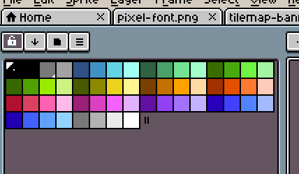
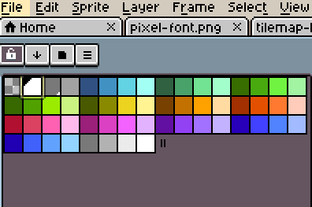
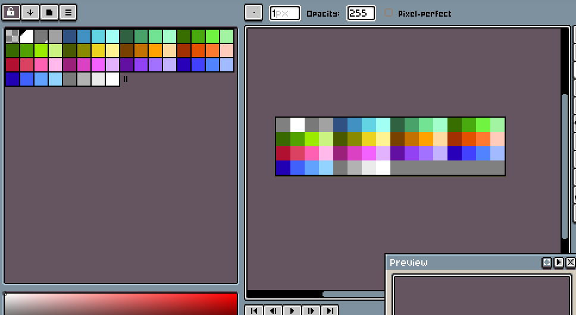
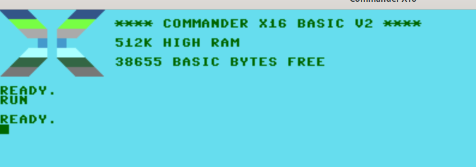
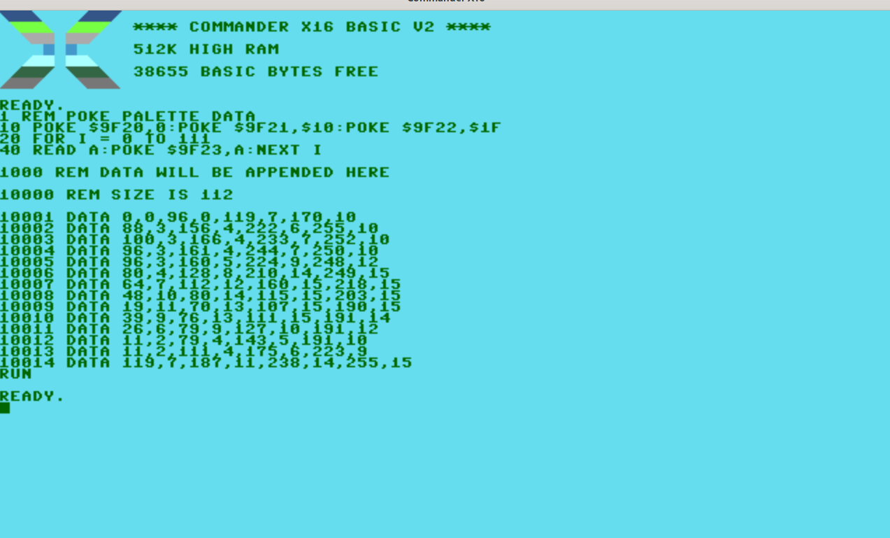

# Example 1: Intro to Aloevera - Importing a palette

### BASIC and CA65 Assembly Code for this example can be found in the [samples/palette](../samples/palette) directory.


Personally, I'm looking foward to a bit of hobbyist x16 development! It'll be like going back to a slightly-enhanced version of the 80s, where someone put Amiga-esqe capabilities into a C64, gave it a bit more RAM, then gave us a load of tools from the distant future to use for development.

But even though there are plenty of modern tools around with which to develop our graphical assets for the X16, we still need to use them with an awareness of the target hardware's limitations, which in this case means those of the newly-designed retro-but-modern VERA chip. Aloevera is aware of all of the required constraints and limitiations for all of VERA's output modes and options, and will help you ensure anything you create with modern image editors conform to what VERA is expecting.

Graphical asset development for your new X16 project will usually start with the selection of a carefully considered palette, and this palette must take factors such as target pixel-depth and screen mode into account. Fortunately, we're not limited to the 16-colour palette of the C64, but have a massive 256 colours with which to work. This does not mean that all display modes will be capable of showing 256 colours at once; palette data will be interpreted differently depending on VERA's active display mode. Aloevera can format and output image data for all of VERA's display modes, and we'll be exploring how to setup a resource pipeline for most of them throughout these examples.

Since all VERA data ultimately references the palette somehow, it makes sense that Aloevera needs a palette before most of its operations can be run. This first example will demonstrate the creation of a simple palette and demonstrate how to transform it for use on the X16.

## Creating a Palette

Let's launch Aseprite and create our palette (and just pretend that we've already put in the requisite thought and care towards the needs of our project).

In Aseprite, create a new image of any size and shape. It's generally far easier if you select 'indexed' for the colour mode for all images you intend to use for Aloevera. RGB modes can be used as well, but the ultimate output of palette indices by Aloevera may be less predictable (and this may be fine for some use cases).


All asset development projects will start by crafting a palette targeted for the intended display modes, and need to take considerations such as pixel depth into account. For instance, images displayed in 4 BPP (i.e. 16-Colour) modes will need to ensure that all of their pixels are selected from a range of colours no more than 15 indices apart on the palette, and that these indicies are aligned to a multiple of 16. Colours in 2 BPP (8 Colour) modes need to be 3 indices apart, while 8 BPP (256-Colour) modes can use the entire range of the palette. 

There will be much more on what this means and how it affects our development pipeline later, but for now let's carefully create our palette by clicking on the foldery-thingy on top of the palette display and selecting a NES palette, which gives us a few nice default gradients to work with:



I'm going to make a couple of tiny changes just for quality-of-life reasons. I'll turn down the alpha of the display at index 0 just so it's more apparent, and I'll change index 1 to #FFFFFF just to match the first 2 colour entries in VERA's default palette:



Now I'm going to hit the burger menu above the palette, hit 'Save Palette' and save the result as `nes-palette.png`. Opening up the contents of this file as a separate image, we can see it's generated a tiny file with 1 pixel for each entry in the palette:



## Importing the Palette into Aloevera

Now we're going to import this palette into a fresh Aloevera project with the `palette import` command.

First, in the same directory as the palette file, we create a new Aloevera project file:

```.sh
aloevera create project.av
```

We now need to import the palette and give it an internal id that later commands can reference. Most Aloevera commands require the `-p` flag, which refers to the project file on which we're currently operating.

```.sh
aloevera -p project.av palette import palette_1 nes-palette.png
```

All going well, the command should execute and you should have a project file containing the palette. Although we should never need to manipulate the project file directly, there's no harm opening it up and looking at the palette entries, which should look similar to:

```

  "palettes": {
    "palette_1": {
      "id": "palette_1",
      "entries": [
        {
          "r": 0,
          "g": 0,
          "b": 0
        },
        {
          "r": 0,
          "g": 6,
          "b": 0
        },
        {
          "r": 7,
          "g": 7,
          "b": 7
        },
```

## About Aloevera Palettes

Now, a couple of important things that should be noted about your palette image files and how they are imported.

* If the source `.png` file uses indexed colour, the palette information will be derived from the png's palette and the actual contents of the image will be ignored.

* If the source `.png` file uses RGB colour, the palette infomation will be derived from contents of the image itself. Each palette entry will be created from the first pixel of each colour that exists in the source image (read left to right, top to bottom). If the number of colours that exists in the image is greater than 256, the operation will fail. In our example above, the image data is laid out to ensure the result of reading it in RGB mode would result in the same information as reading the palette indices. In most cases, you'd only want to derive the palette from an image in RGB mode if you're using 8BPP images and don't need to consider the palette of other image files too carefully.

* Aloevera stores palette data internally as 24 bits per pixel, one byte each for the red, green and blue channels (alpha in the source image is ignored). However, VERA palette entries are stored as 4 bits each for the red, green and blue channels. Therefore, when Aloevera outputs VERA palette data, the 4 least signficant bits of each color index is truncated. In practical terms, this means that a value of, e.g. #45D3F8 becomes #4DF, and all 'shades' in image files that result in #4DF will be treated as one and the same by future Aloevera operations.

Now we have a palette imported, ready for future operations. We'll get to those operations later, but first let's take the opportunity to demonstrate the rest of Aloevera's workfow in a minimal example by assembling the palette information and poking it into the x16 emulator.

The ultimate output of Aloevera is assembled data ready for inclusion by popular assemblers or concatenated into a BASIC program. This is done with the `asm` command as follows:

```.sh
aloevera -p project.av ./output
```

This assembles all the resources in the project file (which in this example is only a palette), and places them into the target directory in the order in which they were included. There should now be a directory `output` which should contain a `palette` directory that contains a single file with the ID of the palette we imported earlier, that is to say `palette_1.ca65.inc`. Let's look at the contents of this file:

```[code]
;my_new_palette size is 112

.byte $00,$00,$60,$00,$77,$07,$AA,$0A
.byte $58,$03,$9C,$04,$DE,$06,$FF,$0A
.byte $64,$03,$A6,$04,$E9,$07,$FC,$0A
.byte $60,$03,$A1,$04,$F4,$07,$FA,$0A
.byte $60,$03,$A0,$05,$E0,$09,$F8,$0C
.byte $50,$04,$80,$08,$D2,$0E,$F9,$0F
.byte $40,$07,$70,$0C,$A0,$0F,$DA,$0F
.byte $30,$0A,$50,$0E,$73,$0F,$CB,$0F
.byte $13,$0B,$46,$0D,$6B,$0F,$BE,$0F
.byte $27,$09,$4C,$0D,$6F,$0F,$BF,$0E
.byte $1A,$06,$4F,$09,$7F,$0A,$BF,$0C
.byte $0B,$02,$4F,$04,$8F,$05,$BF,$0A
.byte $0B,$02,$6F,$04,$AF,$06,$DF,$09
.byte $77,$07,$BB,$0B,$EE,$0E,$FF,$0F
```

[N.B for now, the only assembly target is ca65, but the .byte statement should be included in most assemblers. More targeted support for other assemblers will follow in future work]

That's our palette information formatted for VERA and ready to be incorporated into our assembly project via a simple include statement. 

Code that does exactly this along with instructions on how to run the sample, can be found in the [samples/palette](../samples/palette) directory of this project. The sample also includes a makefile that pulls in changes to resources, so changes to the image file are automatically picked up by the build process. Since Aloevera works like any other command, is can be integrated into your build or development pipeline however you see fit. 

Let's take a quick look at the result of poking this data into VERA's palette location:



And I guess we're looking more NES-ish!

To make it simpler to play around with VERA concepts, Aloevera can also 'assemble' into BASIC DATA statements that can be cut/paste or otherwise concatenated into your basic program. The [palette sample](../samples/palette) contains an example of this, which we'll replicate here due to it's brevity.

To assemble data into basic, use the `--format, -f` command with the `asm` command as follows:

```.sh
aloevera -p project.av -f basic ./output
```

This will create a file called `./output/palettes/palette_1.basic.inc`, that looks much like this:

```[code]
10000 REM SIZE IS 112

10001 DATA 0,0,96,0,119,7,170,10
10002 DATA 88,3,156,4,222,6,255,10
10003 DATA 100,3,166,4,233,7,252,10
10004 DATA 96,3,161,4,244,7,250,10
10005 DATA 96,3,160,5,224,9,248,12
10006 DATA 80,4,128,8,210,14,249,15
10007 DATA 64,7,112,12,160,15,218,15
10008 DATA 48,10,80,14,115,15,203,15
10009 DATA 19,11,70,13,107,15,190,15
10010 DATA 39,9,76,13,111,15,191,14
10011 DATA 26,6,79,9,127,10,191,12
10012 DATA 11,2,79,4,143,5,191,10
10013 DATA 11,2,111,4,175,6,223,9
10014 DATA 119,7,187,11,238,14,255,15 

```

The sample project automatically concatenates this to a simple basic program, with the final result being:

```
1 REM POKE PALETTE DATA
10 POKE $9F20,0:POKE $9F21,$10:POKE $9F22,$1F
20 FOR I = 0 TO 111
40 READ A:POKE $9F23,A:NEXT I  

1000 REM DATA WILL BE APPENDED HERE

10000 REM SIZE IS 112          
  
10001 DATA 0,0,96,0,119,7,170,10
10002 DATA 88,3,156,4,222,6,255,10
10003 DATA 100,3,166,4,233,7,252,10
10004 DATA 96,3,161,4,244,7,250,10
10005 DATA 96,3,160,5,224,9,248,12
10006 DATA 80,4,128,8,210,14,249,15
10007 DATA 64,7,112,12,160,15,218,15
10008 DATA 48,10,80,14,115,15,203,15
10009 DATA 19,11,70,13,107,15,190,15
10010 DATA 39,9,76,13,111,15,191,14
10011 DATA 26,6,79,9,127,10,191,12
10012 DATA 11,2,79,4,143,5,191,10
10013 DATA 11,2,111,4,175,6,223,9
10014 DATA 119,7,187,11,238,14,255,15
```

And running this in the x16 emulator, we get the same (if much slower) NES-ish transformation:



Of course, making the boot screen more NES-ish isn't all that Aloevera can do. Aloevera really starts to become useful when you start to create and import Imagesets, introduced in the next example:

### [Example 2: Intro to Imagesets - Replacing the default font](./ex_002.md)