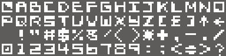
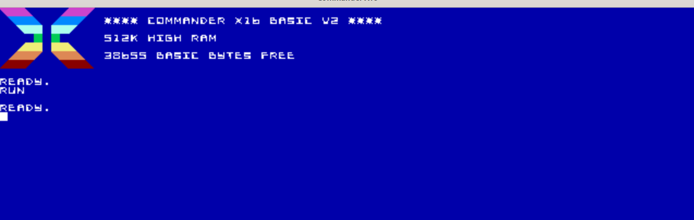
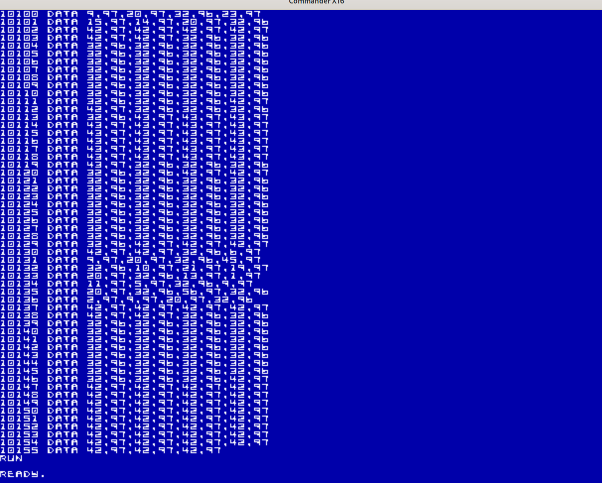

# Example 2: Intro to Imagesets - Replacing the default font

### BASIC and CA65 Assembly Code for this example can be found in the [samples/tile_text](../samples/tile_text) directory.

There are several different VERA display modes, all of which interpret image data differently. As a quick (non-exhaustive) overview, we have:

* Tiled (Text) Modes, 1 or 8 Bits per pixel
* Tiled (Image) Modes, 2, 4 or 8 Bits per pixel
* Bitmap modes, 2, 4 or 8 Bits per pixel
* Sprite Layer display: 4 or 8 Bits per pixel.

Regardless of different pixel depths or interpretation of tilemap data, all display modes operate on the same underlying data structure: A single array of images of uniform width and height.

This structure is obvious when you're working with tilesets, however it should be noted that a single full-screen bitmap also fits into this structure, as does a single-frame sprite. Both are just arrays of images that only contain a single element.

Since all display modes use the same type of underlying data, all image data is imported into Aloevera in an abstract manner as an **Imageset**. Imagesets consist of a series of images (which we'll call **frames** from now on). All frames represent a grid of raw RGB data representing the colour value of each pixel.

When an Imageset is first imported from a PNG file, it doesn't attempt to match any RGB values to a particular palette, nor does it need to know about the target screen mode or pixel-depth. This means you can store palette files separately, and use a single imported palette for a range of different Imageset files.

Transforming Imagesets for use in a particular screen mode and colour depth is done later on during a separate `format` step. Formatting an Imageset does the hard work of validation and selecting the correct palette indices for your screen targets. It ensures that all the indices in the image data match what's in the given palette and it enforces any constraints that may be in place due to the target screen mode. If there is a problem with the Imageset data you're trying to format, Aloevera will tell you all about it long before it turns up as garbage on the actual X16.

This should all become much more clear throughout these examples, but the basic Aloevera workflow is:

* `import` a Palette
* `import` an Imageset
* `format` the Imageset to a target palette and colour depth
* (optionally) `import` (or `init`) Tilesets, Sprites or Bitmap Images that reference the Imageset

Let's get started with a simple example:

## Importing the Imageset

In Aesprite, I've created a basic set of 64 8 by 8 text frames whose locations correspond to the X16's default PETSCII font. The resulting image looks like any other set of tiles.



(Note the above image is enlarged for illustration, and the background colour changed to grey for contrast against the white page. The actual image can be found as part of the [tile_text sample](../samples/tile_text))

I'm going to format this imageset for use in the X16's default Text 1BPP 16 colour mode. We'll get into details of how an actual Tilemap works later, but our first goal is just to get the Imageset imported and replace the default font.

Let's create a project and do the initial import. As discussed earlier, we don't need to worry about target formats just yet, however since we know we're going to be using the imageset in 1BPP mode, we don't need to worry too much about palette data just now. It should suffice just to let Aloevera derive a (small) palette from the image itself.

```.sh
aloevera create project.av
aloevera -p project.av palette import palette_1 pixel-font.png
aloevera -p projevt.av imageset import text_set_1 8 8 pixel-font.png
```

Assuming our font image is an indexed png called `pixel-font.png` (which it just happens to be,) these commands create a new Aloevera project, and imports the palette contained in the image as per the previous example.

Then, it uses the `imageset import` command to import the `pixel-font.png` file as an unformatted Imageset. The `8 8` specify that the tile widths and heights are to be interpreted as 8 and 8, and the id given to the new Imageset is `text_set_1`.

## Formatting the Imageset

Just for the same of example, let's try and do something with this Imageset, like assemble it. 

```.sh
aloevera -p project.av asm ./output
```

This should result in an error.

```
20200214 13:10:13.322 ERROR aloevera - Command failed: Vera module error: Image set text_set_1 not formatted
```

This is because the imageset has not been **formatted** with a palette and target pixel depth. The Imageset has been sliced into individual frames and the colour data of each pixel stored, however at this stage it has no way of meaningfully reconciling these values to palette indices in a particular screen mode. To achieve this, we `format` the imageset to a target pixel-depth.

The rules and constraints for formatting an Imageset will vary depending on screen targets, but for now we'll just focus on the simple rules for 1BPP modes:

* When formatting an Imageset in 1BPP modes, colour data and palettes are ignored and each pixel in each frame is formatted to 'on' or 'off'. If a pixel in the source image contains a non RGB (0,0,0) value, it is considered 'on'. If the pixel value is (0,0,0) (or #000000), it is considered 'off', regardless of any palette information. 

In 1BPP Layer modes, foreground and background colors for each onscreen tile can be specified during the Tilemap stage. We'll be looking at Tilemaps in the next example, but for now we'll just format this Imageset to 1BPP and not worry too hard about the Palette:

```.sh
aloevera -p project.av imageset format text_set_1 palette_1 1
```

The first 2 arguments are the ids of the Imageset and Palette specified in earlier commands, while the `1` specifies a target pixel depth of 1BPP (use `aloevera imageset format --help` to see all possible values).

## Replacing the Default Font

That should be it for our Imageset import! As before, let's run the `asm` command to assemble our resources in assembly and basic:

```.sh
aloevera -p project.av asm ./output/
aloevera -p project.av asm -f basic./output/
```

Since the X16 starts up in Mode 0, i.e. 1BPP Tiled-Text Mode, we should just be able to replace the cold-boot tileset data with our assembled data and watch the font change. Code to do this is found in the [tile_text sample](../samples/tile_text), and the results are as follows:

First, in assembly: Note the new, 'improved' (i.e. much-harder-to-read) font:



And in BASIC, slowly enough that we can see the data being poked in real-time:



Now that we have our custom Imageset in place, the next example will demonstrate how to import and incorporate Tilemaps that reference this Imageset into our project.

### [Example 3: Simple Tilemaps: Displaying a custom banner](./ex_003.md)
