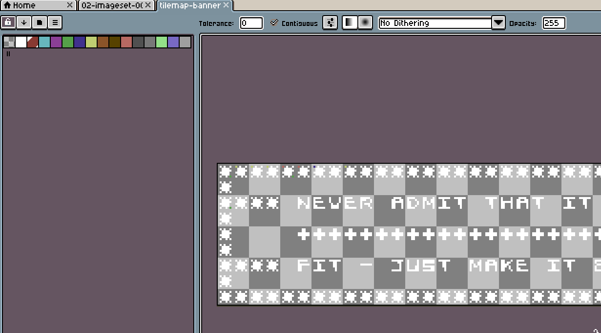
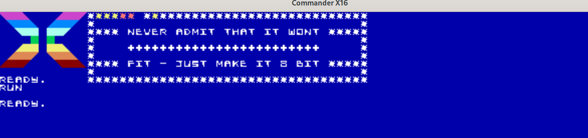
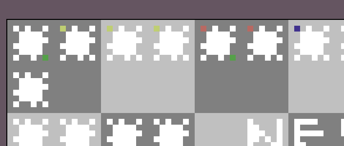
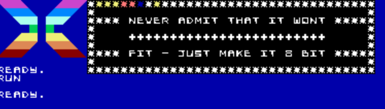

# Example 3: Simple Tilemaps - Displaying a custom banner

### BASIC and CA65 Assembly Code for this example can be found in the [samples/tile_text](../samples/tile_text) directory.

In [the previous example](./ex_002.md), we learned how to use Aloevera to create, import and poke a new imageset into the Commander X16, replacing the default character set with our custom designed one. In this example, we're going to introduce the concept of an Aloevera **Tilemap**, which allows you to reference frames from that Imageset to 'paint' the screen.

If you view an Imageset as a set of tiles, then a Tilemap is a picture painted with those tiles. Aloevera can take a tiled image created with frames matching an existing Imageset and, so long as it respects the Imageset's formatting and constraints, it can assemble a Tilemap ready for poking into VERA.

Without further ado, here's an example of a tile 'banner' painted with frames from the previous Imageset. (This is all being performed within the same [tile_text sample](../samples/tile_text)):

## Creating a Tilemap



Every 8 by 8 pixel tile in this Image matches a tile in the previously imported Imageset. Since this is intended for use in a 1 BPP mode, the coloured pixels you might have spotted on some of the 'painted' tiles don't matter when it comes to matching Imageset frames. Tilemaps in 1BPP modes are only concerned with whether pixels are "on" or "off" and will reconcile to the source Imageset so long as the same pixels are "on" or "off", regardless of the colour of an "on" pixel. More on this in a little bit.

For flavour, we've also included a palette in this image that corresponds to the first 16 entries in VERA's default palette (which is also the C64 default palette). As stated in the previous example, foreground and background colours are applied by Tilemaps in 1 BPP modes, whereas at higher pixel-depths this information would be contained in the Imageset itself. Since we're still using a 1BPP mode for our example we'll import this new palette for use with our Tilemap.

## Importing the Tilemap

Starting with the results from the previous example, we'll import a second palette, i.e. the contents of the palette of this indexed png:

```.sh
aloevera -p project.av palette import palette_tilemap tilemap-banner-1bpp.png 
```

And with a new palette imported, we `init` a new Tilemap. We can't just import a Tilemap directly from a PNG, as Aloevera first needs to know which layer mode it's targeting.

```.sh
aloevera -p project.av tilemap init tilemap_1 text_set_1 128 64 text_16
```

`tilemap_1` is, as with all previous commands, the id of the new Tilemap. `text_set_1` is the id of the previously imported Imageset. All Tilemap frames (which we'll load in the next step,) must only contain tiles that correspond to the frames of this Imageset.

`128 64` is the target map width and height. This just happens to be the size of the Tilemap in the X16's default display. `text_16` is the target layer mode, also corresponding to the X16 default. We'll look at a few other modes in later examples, but for know just know this means that all map data entries in this mode are stored as an 8 bit tile index followed by a 4 bit background colour index and a 4 bit foreground colour index.

Finally, we'll load the Tilemap data itself from our source image. Since this is a 1BPP mode, we'll also need to reference the palette we just created.

```.sh
aloevera -p project.av tilemap load -p palette_tilemap -x 1 -y 10 -c 6 tilemap_1 tilemap-banner-1bpp.png
```

We'll go over the flags and switches in just a second (and remember Aloevera is intended to be included in other build scripts, so you'll only be typing this once,) but we've basically told Aloevera to import our banner into the `tilemap_1` Tilemap using `palette_tilemap` to reconcile its indices.

## Loading the Tilemap

To understand how to incorporate this tilemap into your code, and to better understand the optional switches from the `tilemap load` command, let's have a quick look at the tilemap's assembly output:

```.sh
;tilemap_1 size is 630
;Start write into map_data addr + $A02
;read 70 to write addr
;skip 186 write positions
;until 630 bytes written
    
.byte $2A,$61,$2A,$67,$2A,$67,$2A,$67 
.byte $2A,$6A,$2A,$6A,$2A,$66,$2A,$61 
.byte $2A,$67,$2A,$61,$2A,$61,$2A,$61 
.byte $2A,$61,$2A,$61,$2A,$61,$2A,$61 
.byte $2A,$61,$2A,$61,$2A,$61,$2A,$61 
...
...
```

The byte data is included as usual, but Aloevera has also provided some instructions on how this Tilemap should be loaded. Our [tile_text sample](../samples/tile_text) just happens to follow these instructions, and here's the result of our assembly output:



There's our banner, and it's located at the `x` and `y` position specified during our `tilemap load` command.

To see what's going on here, you need to understand that VERA's Tilemap widths and heights don't correspond to the screen display. For instance, the default 80x60 column text you see on the X16's boot is actually an 80x60 "window" onto 128x64 tilemap entries (of 2 bytes each), which is why the `tilemap init` step needs these dimensions specified explicitly. Further, our banner represents an even smaller window, far smaller than the dimensions of the target map.

If I wanted to display the banner in a particular location on the 80x60 "window", there are two options. The first is to create a 128x64 tilemap image corresponding to the entire default tilemap space, fill it with blank frames then 'paint' the banner where I wanted it within the first 80x60 portion of the tilemap. This is certainly possible with Aloevera, and would mean that the write to VERA's Tilemap info would be a simple write of the 128x64x2 bytes somewhere into VERA's VRAM.

However, this is also very wasteful; we'd be spending time updating indices we're not necessarily interested in, would overwrite what's already onscreen and needlessly take up space in our binary. This may be what's required for certain applications, but for our purposes of just displaying a banner in an area of the screen, it's not the right approach.

The second method is to only output the data to a "window" that we're interested in, then ensure we're skipping 'empty space' on the map as we're writing our tilemap data. The `x` and `y` coordinates provided in the `tilemap load` command tell Alovera where on the base map our Tilemap should start, so it can make these calculations for you and tell you how to write the data.

## 1BPP Colour

You may have noticed a few pixels of colour in the image above. Let's take a closer look:



Now take a closer look at the actual results:


This demonstrates the current method by which foreground colours are applied to tilemaps in 1BPP mode. Basically:

* The first non-zero (#000) pixel in the image is assumed to be the foreground colour.
* The background colour is set universally by the -c flag during load time. `-c 6` in the load command above is the default background colour on the X16 boot screen.

Note there is currently no way to specify backgrounds tile-by-tile, and that this method of specifying foreground and background colours in 1BPP modes may change in future versions (read: I'm not entirely happy with it)

256 Colour Text mode only takes a foreground colour in the Tilemap, so the above method, which only works for specifying a foreground colour, is fine in all cases here. Here's a sample result that would have occurred had we created our tilemap for 256 Text mode instead with:

```.sh
aloevera -p project.av tilemap init tilemap_1 text_set_1 128 64 text_256
```



Though we don't poke the X16 into 256 Text mode in this example, you can see the background information is gone (set to 0,0,0), and in 256 colour text mode will display the constant background colour.

## Conflating Tilemaps

In most target output formats, Tilemaps are usually exported in the space-conserving mode outlined above, and the programmer must take extra steps to load the image data correctly. However, it is possible to export Tilemaps into a direct-load format, in which the data is padded with zeroes to match the dimensions of the target VERA Bitmap dimensions. This is done via the `--conflate_tilemaps, -c` flag:

```.sh
aloevera -p project.av -c asm ./output all
```

This will export Tilemaps in 'conflated' mode, which are much larger in size but can be loaded directly.

Note then when exporting .BIN files, Tilemaps are automatically conflated regardless of the presence of this flag. See [Example 7](ex_007.md) for details of exporting .BIN files.

## Higher Depth Tilesets

We've probably had our fill of 1BPP modes for now. The next example will use all the concepts currently introduced in 4BPP Tile mode to create something a bit more game-like.

### [Example 4: Higher Depth Tilemaps - A more game-like tilemap](./ex_004.md)
