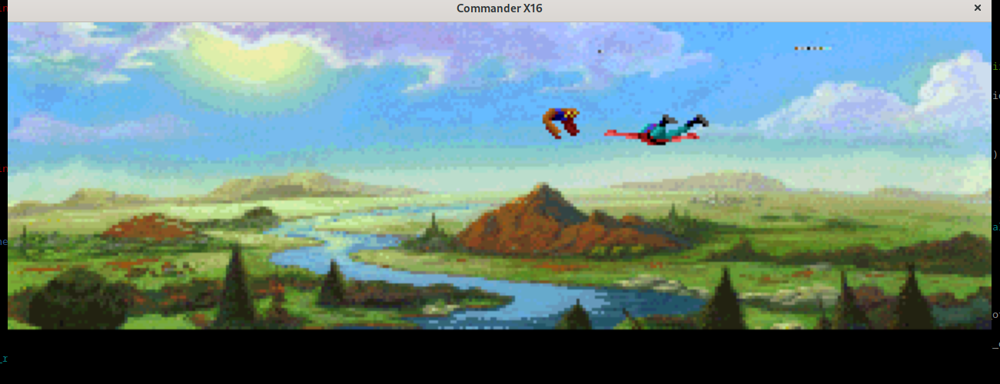

# Example 6: .BIN Files, Other Formats and SDCard Image Output

### BASIC Code for this example can be found in the [samples/sd_card](../samples/sd_card) directory.

Remember seeing something like this for the first time in an early 90's magazine?

Such colour, such wow! Your trusty C64 cannot do this. It can't even dream about running the seperately-released EGA version. This image is from that delicate time when we all had to start moving to Amigas or 'IBM Compatibles' to even have a hope of running KQ5 from its 395 High-Density disks in all of its intended 256 Colour, AdLib-parping glory.

The X16 can ... maybe kind of approximate Kings Quest V. Or maybe something more like Kings Quest IV... it would likely involve a lot of loading and memory banking, but it feels doable. At any rate, Aloevera does not offer an opinion on your KQ5 remake project, but it can help you with formatting bitmaps for display in VERA layer display modes 5, 6 and 7, i.e. Bitmap 2/4/8 BPP modes.

As expected, an Aloevera Bitmap is just a wrapper around a single-frame Imageset that validates its parameters. These are:

* The Imageset's width must be 640 or 320 pixels. (The height can effectively be whatever you want it to be.)
* It must be Formatted as 2, 4 or 8 BPP.

As with Sprites, the palette offset for Bitmaps will be specified separately by the programmer.

Our [bitmap sample](../samples/bitmap) somewhat imperfectly loads a version of this image and places it onto the commander X16's screen. More precisely, it loads this image:

The original MCGA image is 320x200 at 8 BPP, and to load it we'd need to somehow get a whopping 64k worth of data into VERA's 128k of Video RAM. Very possible, but since that amount of data blows past the immediately available space on the X16 for machine code, we'd need to store the image data separately and put together some loading routines to display the entire image. All of this this is currently well beyond the scope of our humble assembly sample. So we'll just halve the image size, and load 320x100 (32k worth of image data instead).

And here's the result of our 32k splat into the base of VRAM without any concern for what else might be present [N.B The currently included sample could use some cleanup]:

This sample goes for the full 8BPP mode in an attempt to recreate the MCGA days, but you can of course use Aloevera in exactly the same manner to import more conservative 4 or even 2BPP full-screen backdrops into your code.

And a final note: A BASIC version is not provided, as I imagine you have better things to be doing than waiting for 32k worth of DATA statements to be transferred into the emulator. But if you want the genuine 80's experience, I recommend you take the opportunity to print out the code, bind it together in a magazine style format, and type it all in manually.

### [Example 7: .BIN Files, CC65 and Manual Layouts](./ex_007.md)

