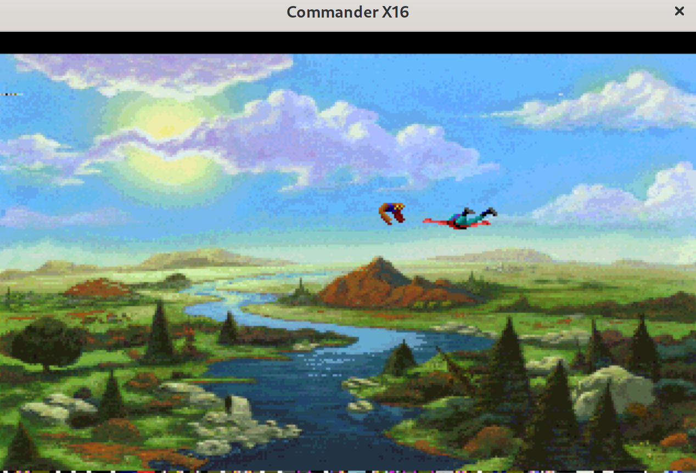

# Example 7: .BIN Files, CC65 and Manual Layouts

### BASIC Code for this example can be found in the [samples/binfiles](../samples/binfiles) directory.

Thus far, all of our examples have involved outputting assembly or BASIC statements to be included directly in your program code, which is fine for smaller projects with a few smallish resources and/or for the sake of learning. 

In real-world projects you'll likely want to keep your code segment dedicated to code, and load larger resources from an external source directly into video RAM. Fortunately, Aloevera can also output resources as .BIN files, ready for direct load into video RAM via the VLOAD statement or other means. 

## Exporting .BIN Files to a Specific Location

A BIN file is simply data in binary format with a two-byte prefix appended indicating the intended load address. The programmer can also place the data into memory as desired.

To assist with laying out assembled resources in a more precise manner, the `asm` command also has a `select` mode which allows you to export individual resources from the project file and control where and how they're exported at an individual level. 

Let's put these concepts together with a quick example from the [samples/binfiles](./samples/binfiles/) project:

```.sh
aloevera -p project.av asm -f bin . select -a 0x0000 kq5_bmp KQ5.BIN
```

`-f bin` denotes that we want to export our resourcs as .BIN files. `. select` means that we're exporting a particular asset, and the `.` (i.e. the current directory) will be applied as a prefix to the name of the final output file. `-a 0x0000` is an optional load address for the .BIN file prefix, and will default to 0x0000 if not provided. Finally, `kq5_bmp` is the previously imported asset ID in the project file, and `KQ5.BIN` is the final output file (which will be prefixed with `.` to produce `./KQ5.BIN`)j

This gives us two files, `KQ5.BIN` containing the prefixed `.BIN` file, and `KQ5.BIN.meta`, which contains info about the width, palette offset, etc. 

The provided BASIC code loads the Palette and the Image data directly via the VLOAD command, and we're easily able to get the entire 64K worth of image loaded into VRAM:



## Note about Tilemaps in .BIN Mode

When exporting tilemaps as .BIN files, they are automatically conflated to match the target screen tilemap dimensions, as if they had been created with the `--conflate_tilemaps, -c` flag. See [Conflating Tilemaps](ex_003.md#conflating_tilemaps) for more details.

## CC65 Header Files

Although the sample code doesn't use cc65, Aloevera can also export data as cc65 compatible header files for direct inclusion in your cc65 project. To export a resource as a header file, simply provide the `-f cc65` flag to the `asm` command. The [sprites sample](../samples/sprites) has been sneakily amended to also produce cc65 header files, which look much like this:

```
/**
 * terra_sprite - Total size is 768
 * terra_sprite - Frame size is $100
 * Frame 0 starts at addr + $0
 * Frame 0 pal offset - 0
 * Frame 1 starts at addr + $100
 * Frame 1 pal offset - 0
 * Frame 2 starts at addr + $200
 * Frame 2 pal offset - 0
 * terra_imageset - size is 768
 */
#ifndef TERRA_SPRITE_H
#define TERRA_SPRITE_H
static const unsigned char TERRA_SPRITE[] = {
    0x00,0x00,0x00,0x00,0x00,0x00,0x00,0x00,
    0x00,0x00,0x00,0x00,0x00,0x00,0x00,0x00,
    0x00,0x00,0x00,0x00,0x00,0x00,0x00,0x00,
    0x00,0x00,0x00,0x00,0x00,0x00,0x00,0x00,
    0x00,0x00,0x01,0x10,0x11,0x12,0x21,0x00,
    0x00,0x00,0x13,0x33,0x33,0x31,0x24,0x10,
    0x00,0x11,0x55,0x53,0x55,0x55,0x12,0x11,
    0x01,0x55,0x35,0x65,0x56,0x55,0x31,0x51,
    0x00,0x11,0x55,0x55,0x55,0x35,0x31,0x51,
```

## SDCard Image Output (Experimental)

Aloevera can also create SDCard images, and export resources directly to  SDCard image files. The [binfile](../samples/binfile) sample currently does this as part of its build process:

```.sh
aloevera create sd_image kq5.img
aloevera -p project.av asm -s kq5.img -f bin . select -a 0x0000 kq5_bmp KQ5.BIN
```

The `create sd_image` command creates a new SDCard Image from a template, and the `-s` flag to `asm` commands specifies that aloevera should output to the given SD Card image's filesystem instead of the local filesystem.

This currently works within Aloevera, and images created with Aloevera can be mounted directly in the OS. However, the images do not work in the emulator with the `-sdcard` flag. It's also unclear whether and how the final system will employ direct reading from SDCards, or whether it will rely on an IEC interface instead. This section will be expanded when the situation is clarified.

### [Back to Contents](./readme.md)
